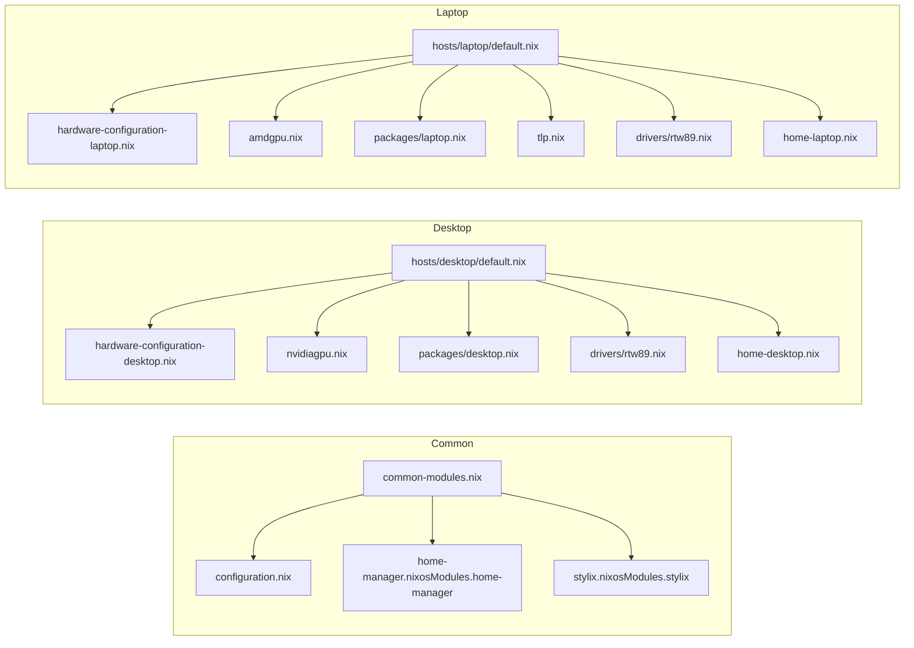

# Graphe des modules

```mermaid
flowchart LR
  subgraph Common
    CM[common-modules.nix] --> CFG[configuration.nix]
    CM --> HMN[home-manager.nixosModules.home-manager]
    CM --> STYLIX[stylix.nixosModules.stylix]
  end

  subgraph Desktop
    HD[hosts/desktop/default.nix] --> HWD[hardware-configuration-desktop.nix]
    HD --> NG[nvidiagpu.nix]
    HD --> PD[packages/desktop.nix]
    HD --> RTW89D[drivers/rtw89.nix]
    HD --> HOMED[home-desktop.nix]
  end

  subgraph Laptop
    HL[hosts/laptop/default.nix] --> HWL[hardware-configuration-laptop.nix]
    HL --> AG[amdgpu.nix]
    HL --> PL[packages/laptop.nix]
    HL --> TLP[tlp.nix]
    HL --> RTW89L[drivers/rtw89.nix]
    HL --> HOMEL[home-laptop.nix]
  end
```

## À retenir

- Les modules GPU sont séparés (`amdgpu.nix`, `nvidiagpu.nix`).
- Les paquets communs sont dans `packages/common.nix`; les extras host sont séparés.
