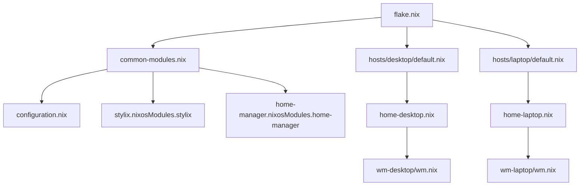

# Vue d'ensemble

La flake expose deux configurations NixOS:

- `desktop`
- `laptop`

Les deux hosts partagent un socle commun (`common-modules.nix` + `configuration.nix`) puis ajoutent leurs modules spécifiques (GPU, paquets, services).

## Principes

1. **Base commune**: boot, réseau, sécurité, audio, services partagés.
2. **Spécificité par machine**: GPU, virtualisation, firewall, tuning.
3. **Session utilisateur**: Home Manager + configuration WM.
