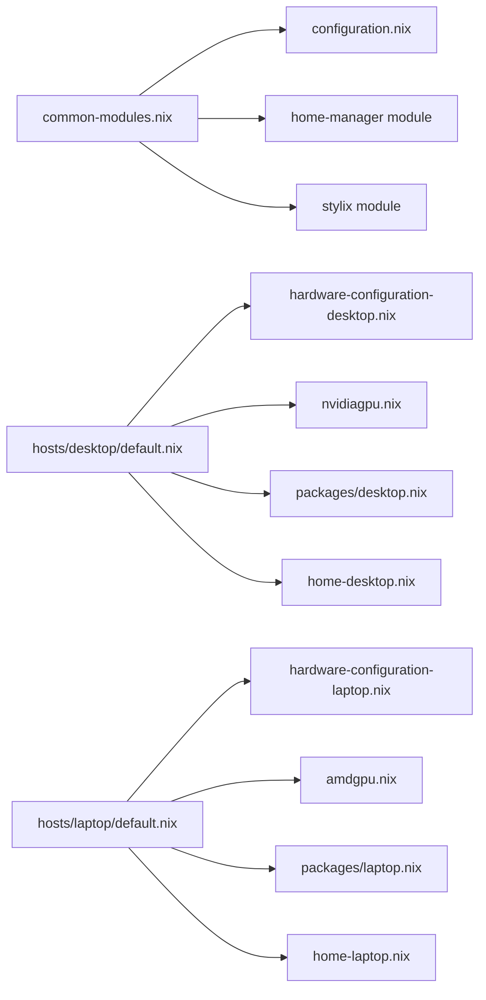

# Module graph

```mermaid
flowchart LR
  CM[common-modules.nix] --> CFG[configuration.nix]
  CM --> HMN[home-manager module]
  CM --> STYLIX[stylix module]

  HD[hosts/desktop/default.nix] --> HWD[hardware-configuration-desktop.nix]
  HD --> NG[nvidiagpu.nix]
  HD --> PD[packages/desktop.nix]
  HD --> HOMED[home-desktop.nix]

  HL[hosts/laptop/default.nix] --> HWL[hardware-configuration-laptop.nix]
  HL --> AG[amdgpu.nix]
  HL --> PL[packages/laptop.nix]
  HL --> HOMEL[home-laptop.nix]
```
