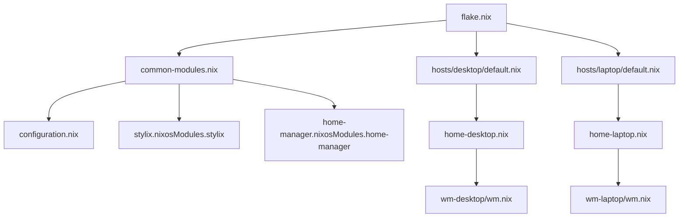

# Overview

The flake exposes two NixOS configurations:

- `desktop`
- `laptop`

Both hosts share a common base (`common-modules.nix` + `configuration.nix`) and then add host-specific modules (GPU, packages, services).

